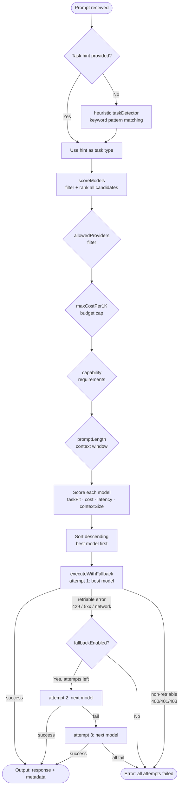

# n8n-nodes-ai-router

[](https://www.npmjs.com/package/n8n-nodes-ai-router)
[](LICENSE)
[](https://docs.n8n.io/integrations/community-nodes/)

An N8N community node that **automatically routes AI tasks to the most appropriate and cost-effective model** across Anthropic, OpenAI, Google Gemini, Mistral AI, Groq, and local Ollama instances.

Instead of hardcoding a single AI model in your workflows, the AI Router analyzes each incoming prompt — detecting whether it's a coding task, creative writing, data analysis, summarization, vision, or plain chat — and picks the best model based on your configured priority: cheapest, fastest, highest quality, or a smart balance. It maintains a built-in scoring engine that weighs task fit, token cost, response latency, and context window size, then automatically falls back to the next-best model if the primary one fails.

## Table of contents

- [Installation](#installation)
- [Configuration](#configuration)
- [How routing works](#how-routing-works)
- [Model registry](#model-registry)
- [Keeping the registry up to date](#keeping-the-registry-up-to-date)
- [Adding a custom model](#adding-a-custom-model)
- [Example workflow](#example-workflow)
- [Contributing](#contributing)
- [License](#license)

---

## Installation

### Via N8N Community Nodes UI (recommended)

1. In your n8n instance, go to **Settings → Community Nodes**
2. Click **Install**
3. Enter `n8n-nodes-ai-router`
4. Click **Install**

### Via npm (self-hosted)

```bash
cd ~/.n8n
npm install n8n-nodes-ai-router
# Restart n8n
```

### Local development install

```bash
cd /path/to/n8n-nodes-ai-router
npm run build
cd ~/.n8n
npm install /path/to/n8n-nodes-ai-router
# Restart n8n
```

### Credentials setup

After installation, configure credentials for each provider you want to use. At least one provider must be configured.

Go to **Credentials → New Credential** and add any of:
- **Anthropic API** — get key at [console.anthropic.com](https://console.anthropic.com/)
- **OpenAI API** — get key at [platform.openai.com](https://platform.openai.com/)
- **Google Gemini API** — get key at [aistudio.google.com](https://aistudio.google.com/)
- **Mistral AI API** — get key at [console.mistral.ai](https://console.mistral.ai/)
- **Groq API** (free tier available) — get key at [console.groq.com](https://console.groq.com/)

For Ollama (local), no credential is needed — just configure the base URL in the node.

---

## Configuration

| Parameter | Type | Default | Description |
|---|---|---|---|
| **Prompt** | string (required) | — | The input text to send to the AI model |
| **Routing Mode** | enum | `auto` | How to prioritize model selection (see modes below) |
| **Task Hint** | enum | auto-detect | Override automatic task detection |
| **Max Cost Per 1K Tokens** | number | `0` (no limit) | Hard budget cap in USD; models above this are excluded |
| **Allowed Providers** | multiselect | all | Which providers are eligible for routing |
| **Ollama Model** | string | `llama3` | Model name for local Ollama (shown when Ollama is selected) |
| **Ollama Base URL** | string | `http://localhost:11434` | URL of your local Ollama instance |
| **Enable Fallback** | boolean | `true` | Whether to retry with the next-best model on failure |
| **Include Model Info in Output** | boolean | `false` | Whether to add `modelUsed`, `providerUsed`, and token counts to output |

### Routing modes

| Mode | Description | Best for |
|---|---|---|
| `auto` | Balanced scoring across all criteria | General-purpose workflows |
| `cost` | Strongly favors cheapest viable model | High-volume, budget-sensitive workflows |
| `quality` | Strongly favors best task-fit model | Critical outputs where quality matters most |
| `speed` | Strongly favors lowest-latency model | Real-time or latency-sensitive workflows |
| `local` | Ollama only — zero cost, fully private | Privacy-sensitive data, offline environments |

### Task hint values

| Value | Detected when prompt contains |
|---|---|
| `coding` | Function definitions, language names, file extensions, debug/refactor keywords |
| `writing` | Write/draft/compose + document types (email, blog, essay, story) |
| `analysis` | Analyze, evaluate, compare, pros/cons, explain why |
| `summarization` | Summarize, tl;dr, key points, in N bullets |
| `classification` | Classify, categorize, sentiment, true/false, spam |
| `vision` | Image URLs, base64 image data, OCR mentions |
| `embeddings` | Embed, vector, semantic search, RAG |
| `chat` | Greetings, conversational questions (default fallback) |

---

## How routing works



### Scoring formula

For each candidate model, a total score (0–1) is computed:

```
score = w_taskFit × taskAffinity[task]
      + w_cost    × (1 − blendedPer1K / maxInPool)
      + w_latency × (1 − (latencyTier − 1) / 2)
      + w_context × (contextWindow / maxInPool)
```

Weights `w_*` vary by mode:

| Mode | taskFit | cost | latency | contextSize |
|---|---|---|---|---|
| auto | 0.35 | 0.25 | 0.20 | 0.20 |
| quality | 0.55 | 0.05 | 0.10 | 0.30 |
| cost | 0.20 | 0.60 | 0.10 | 0.10 |
| speed | 0.25 | 0.15 | 0.50 | 0.10 |
| local | 0.40 | 0.40 | 0.10 | 0.10 |

---

## Model registry

Pricing verified March 2026. `blendedPer1K = (input×0.7 + output×0.3) / 1000`.

### Anthropic

| Model ID | Input/1M | Output/1M | Context | Best for |
|---|---|---|---|---|
| `claude-opus-4-6` | $5.00 | $25.00 | 1M | Complex analysis, long-context reasoning |
| `claude-sonnet-4-6` | $3.00 | $15.00 | 1M | Balanced quality across all tasks |
| `claude-haiku-4-5-20251001` | $1.00 | $5.00 | 200K | Fast chat, classification, vision |

### OpenAI

| Model ID | Input/1M | Output/1M | Context | Best for |
|---|---|---|---|---|
| `gpt-4.1` | $2.00 | $8.00 | 1M | General chat, coding, vision |
| `gpt-4o` | $2.50 | $10.00 | 128K | Multimodal, vision tasks |
| `o3` | $2.00 | $8.00 | 200K | Deep reasoning (no streaming) |
| `o4-mini` | $1.10 | $4.40 | 200K | Cheaper reasoning, STEM, code |
| `gpt-4o-mini` | $0.15 | $0.60 | 128K | Cheap chat, classification, vision |

### Google Gemini

| Model ID | Input/1M | Output/1M | Context | Best for |
|---|---|---|---|---|
| `gemini-3.1-pro-preview` | $2.00 | $12.00 | 1M | Cutting-edge quality (preview) |
| `gemini-2.5-pro` | $1.25 | $10.00 | 1M | Long-context analysis, vision |
| `gemini-3-flash-preview` | $0.50 | $3.00 | 1M | Fast next-gen tasks (preview) |
| `gemini-2.5-flash` | $0.30 | $2.50 | 1M | Fast summarization, cheap vision |
| `gemini-2.5-flash-lite` | $0.10 | $0.40 | 1M | Ultra-cheap classification |

### Mistral

| Model ID | Input/1M | Output/1M | Context | Best for |
|---|---|---|---|---|
| `mistral-large-2512` | $0.50 | $1.50 | 262K | Cost-efficient coding, analysis |
| `mistral-medium-3` | $0.40 | $2.00 | 131K | Balanced general tasks |
| `mistral-small-4-0-26-03` | $0.10 | $0.30 | 262K | Creative writing, chat |
| `devstral-2-25-12` | $0.10 | $0.30 | 256K | Code generation (SWE-bench 72%) |

### Groq (ultra-fast inference)

| Model ID | Input/1M | Output/1M | Context | Best for |
|---|---|---|---|---|
| `moonshotai/kimi-k2-instruct` | $1.00 | $3.00 | 1M | Long-context analysis, agentic tasks |
| `llama-3.3-70b-versatile` | $0.59 | $0.79 | 128K | Low-latency general tasks |
| `qwen/qwen3-32b` | $0.29 | $0.59 | 128K | Coding, multilingual, reasoning |
| `openai/gpt-oss-120b` | $0.15 | $0.60 | 128K | Balanced quality at ~500 t/s |
| `meta-llama/llama-4-scout-17b-16e-instruct` | $0.11 | $0.34 | 10M | Ultra-cheap vision, huge context |
| `openai/gpt-oss-20b` | $0.075 | $0.30 | 128K | Fastest throughput (~1000 t/s) |
| `llama-3.1-8b-instant` | $0.05 | $0.08 | 128K | Cheapest, sub-100ms responses |

### Ollama (local)

| Model ID | Cost | Context | Notes |
|---|---|---|---|
| `<your-model>` | $0 | 128K | Any model pulled via `ollama pull` |

---

## Keeping the registry up to date

Provider APIs change faster than documentation. Use the built-in sync script to check for stale or missing model IDs:

```bash
npm run build
npm run sync:models
```

The script checks each provider's live `/models` endpoint against the registry and reports:
- **Stale** — model IDs in the registry that no longer exist on the provider
- **New** — model IDs available on the provider that aren't in the registry yet

What the script **cannot** automate (requires manual updates to `modelRegistry.ts`):
- Pricing (check each provider's pricing page)
- Task affinity scores
- Latency tier and context window

Recommended cadence: run `sync:models` monthly or after you hear about a new model release.

---

## Adding a custom model

Editing a single file is all that's needed: `nodes/AiRouter/router/modelRegistry.ts`.

Append a new entry to `MODEL_REGISTRY`:

```typescript
{
  id: 'your-model-api-id',   // exact string sent in API calls
  provider: 'openai',         // must be an existing ProviderType
  displayName: 'My Model',
  pricing: {
    inputPer1M: 1.00,
    outputPer1M: 4.00,
    blendedPer1K: 0.0019,   // (1.00×0.7 + 4.00×0.3) / 1000
  },
  capabilities: {
    supportsVision: false,
    supportsEmbeddings: false,
    supportsStreaming: true,
    supportsReasoningMode: false,
    isLocal: false,
    contextWindow: 128_000,
  },
  latencyTier: 1,             // 1=fast, 2=moderate, 3=slow (reasoning)
  taskAffinity: {
    coding: 0.88,
    chat: 0.85,
    // Omit tasks where this model has no particular strength (defaults to 0.5)
  },
},
```

Then rebuild: `npm run build`

For a new provider (new API), see [CONTRIBUTING.md](CONTRIBUTING.md#adding-a-new-provider).

---

## Example workflow

A minimal routing workflow:

1. **Manual Trigger** or **Webhook** → receives a user prompt
2. **AI Router** node:
   - Prompt: `{{ $json.message }}`
   - Mode: `auto`
   - Allowed Providers: Anthropic, OpenAI, Google, Groq
   - Enable Fallback: on
   - Include Model Info: on
3. **Respond to Webhook** → returns `{{ $json.response }}`

The output JSON looks like:

```json
{
  "response": "Here is the TypeScript function you requested:\n\n```typescript\nfunction debounce...",
  "modelUsed": "meta-llama/llama-4-scout-17b-16e-instruct",
  "providerUsed": "groq",
  "attemptsTaken": 1,
  "inputTokens": 25,
  "outputTokens": 459
}
```

---

## Contributing

See [CONTRIBUTING.md](CONTRIBUTING.md) for:
- How to add a new model (one object in an array)
- How to add a new provider
- Commit message conventions
- How to test locally

---

## License

[MIT](LICENSE)
