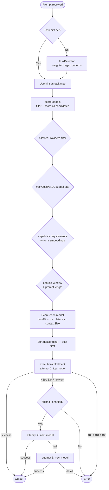

# @auwra/n8n-nodes-ai-router

[](https://www.npmjs.com/package/@auwra/n8n-nodes-ai-router)
[](LICENSE)
[](https://docs.n8n.io/integrations/community-nodes/)

An n8n community node that **automatically routes each prompt to the best AI model** across Anthropic, OpenAI, Google Gemini, Mistral AI, Groq, and local Ollama — based on what the task actually needs.

Instead of hardcoding one model, the AI Router detects whether a prompt is a coding task, analysis, creative writing, summarization, vision, or chat, then picks the optimal model for your priority: cheapest, fastest, highest quality, or balanced. It falls back to the next-best model automatically if the first one fails.

## Table of contents

- [Quick start](#quick-start)
- [Installation](#installation)
- [Configuration](#configuration)
- [How routing works](#how-routing-works)
- [Choosing the right mode](#choosing-the-right-mode)
- [Model registry](#model-registry)
- [Keeping the registry up to date](#keeping-the-registry-up-to-date)
- [Adding a custom model](#adding-a-custom-model)
- [Example workflows](#example-workflows)
- [Changelog](#changelog)
- [Contributing](#contributing)
- [License](#license)

---

## Quick start

1. Install the node (see [Installation](#installation))
2. Add the **AI Router** node to any workflow
3. Set up credentials — paste in at least one API key (Groq has a free tier)
4. Connect your prompt source and run

That's it. The node detects the task, picks the best model, calls it, and returns `response`. No configuration required for basic use.

---

## Installation

### Via n8n Community Nodes UI (recommended)

1. Go to **Settings → Community Nodes**
2. Click **Install**
3. Enter `@auwra/n8n-nodes-ai-router`
4. Click **Install** and restart if prompted

### Via npm (self-hosted)

```bash
cd ~/.n8n
npm install @auwra/n8n-nodes-ai-router
# Restart n8n
```

### Credentials setup

The node uses a **single credential object** called **AI Router Credentials** that holds all your API keys in one place. Fill in only the providers you have — the router automatically skips providers with no key.

| Field | Where to get it |
|---|---|
| Anthropic API Key | [console.anthropic.com](https://console.anthropic.com/) |
| OpenAI API Key | [platform.openai.com](https://platform.openai.com/) |
| Google Gemini API Key | [aistudio.google.com](https://aistudio.google.com/) |
| Mistral AI API Key | [console.mistral.ai](https://console.mistral.ai/) |
| Groq API Key (free tier) | [console.groq.com](https://console.groq.com/) |
| Ollama Base URL | `http://localhost:11434` (no key needed) |

**One provider is enough to get started.** Groq is the easiest: free tier, no credit card.

---

## Configuration

### Input

| Parameter | Type | Default | Description |
|---|---|---|---|
| **Prompt** | string | — | The user message to send to the AI model |
| **System Prompt** | string | — | Optional system-level instruction: persona, output format, constraints |
| **Temperature** | number | `0.7` | Sampling temperature 0–2. 0 = deterministic, 2 = very creative. Ignored by reasoning models. |

### Routing

| Parameter | Type | Default | Description |
|---|---|---|---|
| **Routing Mode** | enum | `auto` | How to prioritise model selection |
| **Task Hint** | enum | auto-detect | Override automatic task detection |

### Filtering / budget

| Parameter | Type | Default | Description |
|---|---|---|---|
| **Allowed Providers** | multiselect | all | Which providers are eligible |
| **Max Cost Per 1K Tokens** | number | `0` (no limit) | Hard budget cap in USD — models above this are excluded |

### Generation

| Parameter | Type | Default | Description |
|---|---|---|---|
| **Max Tokens** | number | `0` (provider default) | Maximum tokens to generate |

### Behaviour

| Parameter | Type | Default | Description |
|---|---|---|---|
| **Enable Fallback** | boolean | `true` | Retry with next-best model on 429/5xx errors (up to 3 attempts) |
| **Dry Run (Routing Only)** | boolean | `false` | Select the best model and return routing info but do NOT call any API — no tokens spent |
| **Max Items Per Execution** | number | `10` | Hard cap on items per run. Set to `0` to disable. |

### Output options

| Parameter | Type | Default | What it adds to output |
|---|---|---|---|
| **Include Model Info** | boolean | `false` | `modelUsed`, `providerUsed`, `attemptsTaken`, `inputTokens`, `outputTokens` |
| **Include Detected Task** | boolean | `false` | `detectedTask`, `detectedTaskConfidence` |
| **Include Score Breakdown** | boolean | `false` | `scoreBreakdown` — top-3 candidates with final score and per-criterion sub-scores |
| **Include Estimated Cost** | boolean | `false` | `estimatedCostUSD` — calculated from token counts × registry pricing |

### Routing modes

| Mode | Best for | What it optimises |
|---|---|---|
| `auto` | General-purpose workflows | Balanced mix of quality, cost, and speed |
| `quality` | Critical outputs, production content | Task-specific model quality above all else |
| `cost` | High-volume, budget-sensitive workflows | Cheapest model that can do the job |
| `speed` | Real-time, latency-sensitive workflows | Lowest-latency model first |
| `local` | Privacy-sensitive data, offline use | Ollama only — zero cost, no data leaves your machine |

### Task hint values

| Value | Auto-detected when prompt contains |
|---|---|
| `coding` | Code snippets, language names, file extensions, debug/refactor/implement |
| `writing` | write/draft/compose + document type (email, blog, essay, story, ad copy…) |
| `analysis` | analyze, evaluate, compare, pros and cons, explain why, root cause |
| `summarization` | summarize, tl;dr, key points, in N bullets, executive summary |
| `classification` | classify, categorize, sentiment, true/false, spam detection |
| `vision` | Image URLs, base64 image data, OCR, visual content |
| `embeddings` | embed, vector, semantic search, RAG, cosine similarity |
| `chat` | Greetings, open-ended questions (default fallback) |

---

## How routing works



### Scoring formula

Each candidate model gets a score (0–1):

```
score = w_taskFit  × taskAffinity[task]
      + w_cost     × (1 − blendedPer1K / maxInPool)
      + w_latency  × (1 − (latencyTier − 1) / 2)
      + w_context  × log(contextWindow + 1) / log(maxInPool + 1)
```

Context uses log normalization so a single model with a huge context window (e.g. 10M tokens) doesn't collapse every other model's score to near zero.

Weights by mode:

| Mode | taskFit | cost | latency | contextSize |
|---|---|---|---|---|
| auto | 0.35 | 0.25 | 0.20 | 0.20 |
| quality | **0.70** | 0.05 | 0.05 | 0.20 |
| cost | 0.20 | **0.60** | 0.10 | 0.10 |
| speed | 0.25 | 0.15 | **0.50** | 0.10 |
| local | 0.40 | 0.40 | 0.10 | 0.10 |

---

## Choosing the right mode

**Use `quality` when:** output accuracy matters (production content, customer-facing responses, complex reasoning). The router will pick the model most specialised for the detected task — Claude Opus for analysis, Devstral for code, Gemini Pro for vision.

**Use `cost` when:** you're running high volume and the task is simple (classification, summarization, short chat). Expect Groq or Gemini Flash Lite to win most of the time.

**Use `speed` when:** you need sub-second responses (real-time chat, live autocomplete). All tier-1 models are fast; the router picks the most capable one among them.

**Use `auto` when:** you're unsure. It's a sensible middle ground — it won't pick the most expensive model for a simple greeting, but it won't use the cheapest one for a complex analysis either.

**Use `local` when:** prompts contain sensitive data you can't send to cloud APIs, or you're working offline.

**Combine mode with `Allowed Providers`** for precise control: `quality` mode with only `anthropic` + `openai` ensures only flagship models are used.

---

## Model registry

Pricing verified April 2026. `blendedPer1K = (input×0.7 + output×0.3) / 1000`.

### Anthropic

| Model ID | Input/1M | Output/1M | Context | Best for |
|---|---|---|---|---|
| `claude-opus-4-6` | $5.00 | $25.00 | 1M | Complex analysis, deep reasoning |
| `claude-sonnet-4-6` | $3.00 | $15.00 | 1M | Balanced quality across all tasks |
| `claude-haiku-4-5-20251001` | $1.00 | $5.00 | 200K | Fast chat, classification, vision |

### OpenAI

| Model ID | Input/1M | Output/1M | Context | Best for |
|---|---|---|---|---|
| `gpt-4.1` | $2.00 | $8.00 | 1M | General chat, coding, vision |
| `gpt-4o` | $2.50 | $10.00 | 128K | Multimodal, vision-heavy tasks |
| `o3` | $2.00 | $8.00 | 200K | Deep reasoning, complex analysis (no streaming) |
| `o4-mini` | $1.10 | $4.40 | 200K | Cheaper reasoning, STEM, code |
| `gpt-4o-mini` | $0.15 | $0.60 | 128K | Cheap chat, classification, vision |

### Google Gemini

| Model ID | Input/1M | Output/1M | Context | Best for |
|---|---|---|---|---|
| `gemini-3.1-pro-preview` | $2.00 | $12.00 | 1M | Cutting-edge quality (preview) |
| `gemini-2.5-pro` | $1.25 | $10.00 | 1M | Long-context analysis, vision |
| `gemini-3-flash-preview` | $0.50 | $3.00 | 1M | Fast next-gen tasks (preview) |
| `gemini-2.5-flash` | $0.30 | $2.50 | 1M | Fast summarization, cheap vision |
| `gemini-2.5-flash-lite` | $0.10 | $0.40 | 1M | Ultra-cheap classification |

### Mistral

| Model ID | Input/1M | Output/1M | Context | Best for |
|---|---|---|---|---|
| `mistral-large-2512` | $0.50 | $1.50 | 262K | Cost-efficient coding, analysis |
| `mistral-medium-3` | $0.40 | $2.00 | 131K | Balanced general tasks |
| `mistral-small-4-0-26-03` | $0.10 | $0.30 | 262K | Creative writing, chat |
| `devstral-2-25-12` | $0.10 | $0.30 | 256K | Code generation (SWE-bench 72.2%) |

### Groq (ultra-fast inference)

| Model ID | Input/1M | Output/1M | Context | Best for |
|---|---|---|---|---|
| `moonshotai/kimi-k2-instruct` | $1.00 | $3.00 | 1M | Long-context analysis, agentic |
| `llama-3.3-70b-versatile` | $0.59 | $0.79 | 128K | Low-latency general tasks |
| `qwen/qwen3-32b` | $0.29 | $0.59 | 128K | Coding, multilingual, reasoning |
| `openai/gpt-oss-120b` | $0.15 | $0.60 | 128K | Balanced quality at ~500 t/s |
| `meta-llama/llama-4-scout-17b-16e-instruct` | $0.11 | $0.34 | 10M | Huge-context vision, ultra-cheap |
| `openai/gpt-oss-20b` | $0.075 | $0.30 | 128K | Fastest throughput (~1000 t/s) |
| `llama-3.1-8b-instant` | $0.05 | $0.08 | 128K | Cheapest, sub-100ms responses |

### Ollama (local)

Any model you've pulled via `ollama pull <model>` works. Set **Ollama Model** to the model name and **Ollama Base URL** to your instance address.

---

## Keeping the registry up to date

Provider APIs change quickly. Use the built-in sync script to check for stale or new model IDs:

```bash
npm run build
npm run sync:models
```

The script hits each provider's live `/models` endpoint and reports:
- **Stale** — IDs in the registry that no longer exist
- **New** — IDs available on the provider not yet in the registry

What must still be updated manually in `modelRegistry.ts`:
- Pricing (check each provider's pricing page)
- Task affinity scores
- Latency tier and context window size

Recommended cadence: run `sync:models` monthly or after a major model release.

---

## Adding a custom model

Edit only one file: `nodes/AiRouter/router/modelRegistry.ts`. Append a new entry to `MODEL_REGISTRY`:

```typescript
{
  id: 'your-model-api-id',   // exact string sent in API requests
  provider: 'openai',         // must match an existing ProviderType
  displayName: 'My Model',
  pricing: {
    inputPer1M: 1.00,
    outputPer1M: 4.00,
    blendedPer1K: 0.0019,   // (1.00×0.7 + 4.00×0.3) / 1000
  },
  capabilities: {
    supportsVision: false,
    supportsEmbeddings: false,
    supportsStreaming: true,
    supportsReasoningMode: false,
    isLocal: false,
    contextWindow: 128_000,
  },
  latencyTier: 1,             // 1=fast  2=moderate  3=slow/reasoning
  taskAffinity: {
    coding: 0.88,
    chat: 0.85,
    // Omit tasks where the model has no particular strength (defaults to 0.5)
  },
},
```

Then rebuild: `npm run build`

For a new provider (new API format), see [CONTRIBUTING.md](CONTRIBUTING.md#adding-a-new-provider).

---

## Example workflows

### Basic chatbot with smart routing

1. **Webhook** → receives `{ "message": "..." }`
2. **AI Router**
   - Prompt: `{{ $json.message }}`
   - Mode: `auto`
   - Enable Fallback: on
3. **Respond to Webhook** → `{{ $json.response }}`

The router detects whether the message is a coding question, analysis request, or casual chat and picks accordingly.

---

### Quality-first content pipeline

1. **Schedule Trigger** → fires daily
2. **HTTP Request** → fetches data to process
3. **AI Router**
   - Prompt: `Analyze the following data and write a professional summary: {{ $json.data }}`
   - Mode: `quality`
   - Allowed Providers: Anthropic, OpenAI, Google
   - Include Model Info: on
4. **Google Sheets** → saves `response`, `modelUsed`, token counts

Mode `quality` with flagship providers ensures you always get the best model for the task. Token counts let you track spend.

---

### Budget-capped high-volume classification

1. **Spreadsheet Trigger** → rows to classify
2. **AI Router**
   - Prompt: `Classify this support ticket as "billing", "technical", or "general": {{ $json.ticket }}`
   - Task Hint: `classification`
   - Mode: `cost`
   - Max Cost Per 1K Tokens: `0.001`
   - Max Items Per Execution: `100`
3. **Spreadsheet** → write back `{{ $json.response }}`

Hard-coding `classification` as the task hint skips detection overhead and ensures the cost-efficient classification models are preferred. The budget cap keeps costs bounded.

---

### Full output (all options enabled)

```json
{
  "response": "Here is the TypeScript function you requested:\n\n```typescript\nfunction debounce...",
  "modelUsed": "devstral-2-25-12",
  "providerUsed": "mistral",
  "attemptsTaken": 1,
  "inputTokens": 25,
  "outputTokens": 459,
  "estimatedCostUSD": 0.0000073,
  "detectedTask": "coding",
  "detectedTaskConfidence": 0.91,
  "scoreBreakdown": [
    { "model": "devstral-2-25-12",            "provider": "mistral", "score": 0.9289, "breakdown": { "taskFit": 1.000, "cost": 0.985, "latency": 0.500, "contextSize": 0.772 } },
    { "model": "moonshotai/kimi-k2-instruct", "provider": "groq",    "score": 0.8800, "breakdown": { "taskFit": 0.880, "cost": 0.855, "latency": 1.000, "contextSize": 0.857 } },
    { "model": "o3",                          "provider": "openai",   "score": 0.8632, "breakdown": { "taskFit": 0.970, "cost": 0.655, "latency": 0.000, "contextSize": 0.757 } }
  ]
}
```

### Dry-run output

When **Dry Run** is enabled, no API call is made and the output is:

```json
{
  "dryRun": true,
  "selectedModel": "devstral-2-25-12",
  "selectedProvider": "mistral",
  "selectedScore": 0.9289,
  "detectedTask": "coding",
  "detectedTaskConfidence": 0.91,
  "scoreBreakdown": [ ... ]
}
```

---

## Changelog

### v0.1.6
- **Add:** `System Prompt` parameter — optional system-level instruction passed to all providers
- **Add:** `Temperature` parameter (0–2, default 0.7) — ignored automatically for reasoning models
- **Add:** `Dry Run` toggle — returns routing decision without spending any tokens; includes selected model, score, detected task, and score breakdown
- **Add:** `Include Detected Task` output option — exposes `detectedTask` and `detectedTaskConfidence` in the output
- **Add:** `Include Score Breakdown` output option — exposes top-3 ranked candidates with final scores and per-criterion sub-scores (taskFit, cost, latency, contextSize)
- **Add:** `Include Estimated Cost` output option — computes `estimatedCostUSD` from token counts × registry pricing

### v0.1.5
- **Fix:** Quality mode now reliably selects flagship models — context score uses log normalization (prevents a single 10M-context model from collapsing all 1M-context scores to 0.1), and quality-mode weights raised `taskFit` to 0.70
- **Add:** `Max Items Per Execution` parameter (default `10`) — hard cap on items processed per run to prevent cost drain from accidental loops or large batches

### v0.1.4
- **Fix:** Anthropic requests no longer hang indefinitely — timeout now correctly catches `AbortError` in Node.js
- **Fix:** `max_tokens` always included in Anthropic requests (required by the API)
- **Fix:** Anthropic responses from reasoning models parsed correctly — text block found by type, not position

### v0.1.2
- Initial public release

---

## Contributing

See [CONTRIBUTING.md](CONTRIBUTING.md) for:
- How to add a new model (one object in an array)
- How to add a new provider adapter
- Commit conventions
- How to test locally

---

## License

[MIT](LICENSE)
